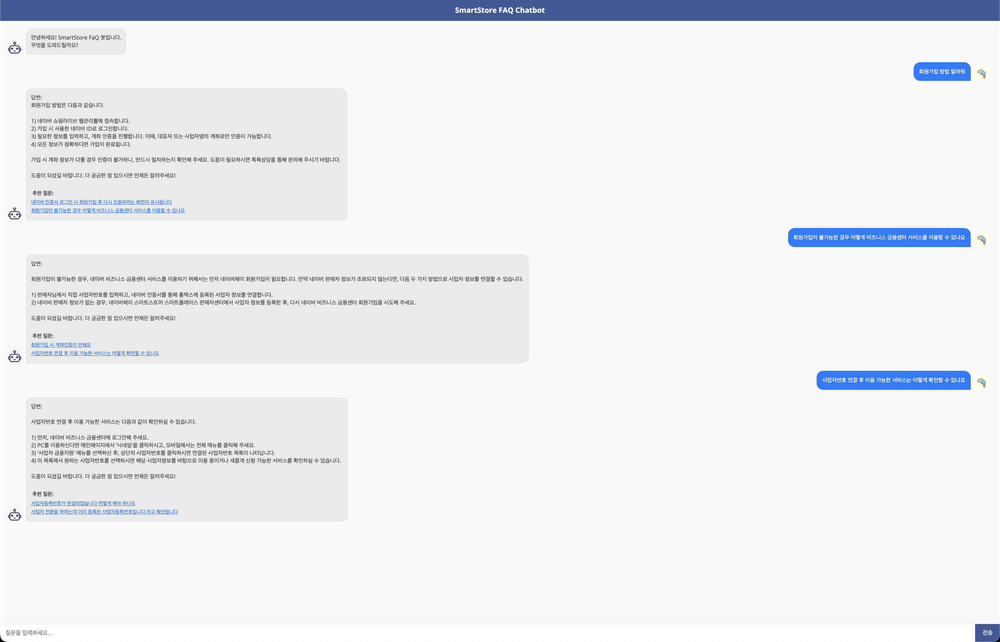
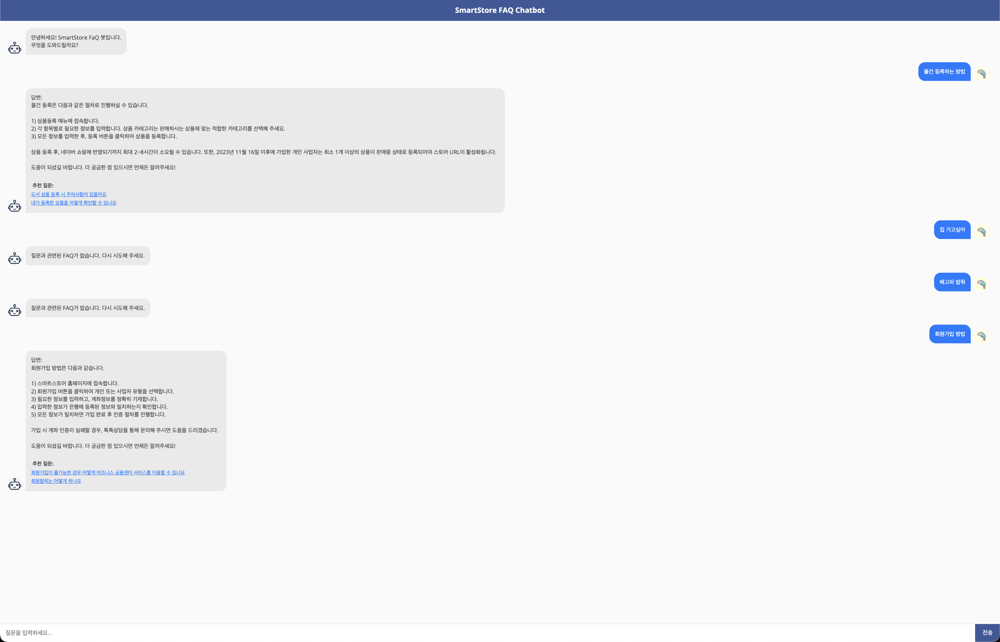

# SmartStore FAQ Chatbot

네이버 스마트스토어의 자주 묻는 질문(FAQ)을 기반으로 한 Retrieval-Augmented Generation (RAG) 기반 챗봇 구현.

## 프로젝트 구조

- `src/` - 소스 코드
- `data/` - 데이터 파일
- `models/` - 임베딩 모델 및 벡터 데이터베이스
- `api/` - API 서버 구현
- `tests/` - 테스트 스크립트
- `docs/` - 문서

## 실행 방법
- .env 파일 추가 -> `OPENAI_API_KEY`
- 의존성 설치 `pip install -r requirements.txt`
- 프로젝트 root 에 `/data/final_result.pkl` 파일 추가
- `cd src`
- `python3 data_loader.py` -> 데이터 전처리
- `python3 create_origin_embeddings_openai.py` -> 데이터 임베딩
- `python3 vector_db.py` -> chromadb 세팅
- `cd ..`
- `python3 main.py` -> 서버 실행
- `http://localhost:8001` 접속

## 실행 화면

